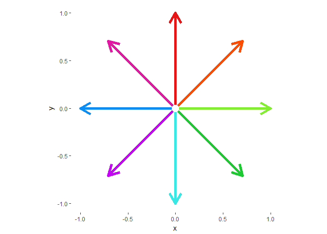
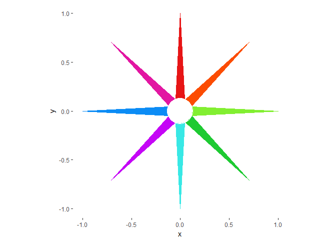
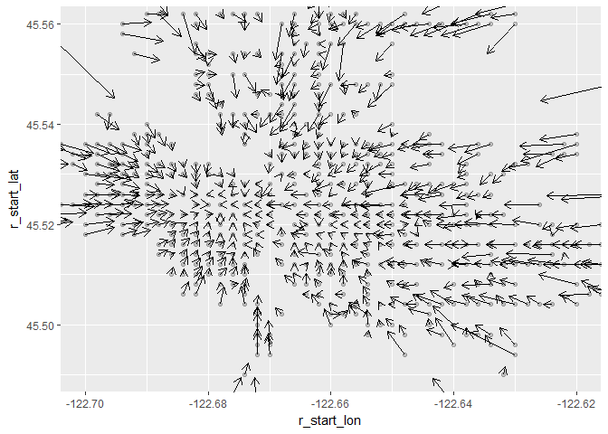
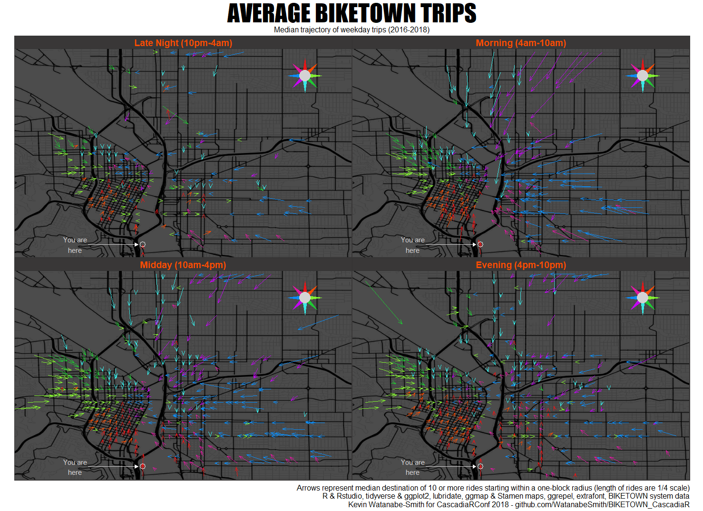

# Data Loading

## Packages  


```r
# Packages
library(tidyverse)
```

```
## -- Attaching packages ------------------------------------------------------------------------------- tidyverse 1.2.1 --
```

```
## v ggplot2 2.2.1     v purrr   0.2.4
## v tibble  1.4.2     v dplyr   0.7.4
## v tidyr   0.8.0     v stringr 1.3.0
## v readr   1.1.1     v forcats 0.3.0
```

```
## -- Conflicts ---------------------------------------------------------------------------------- tidyverse_conflicts() --
## x dplyr::filter() masks stats::filter()
## x dplyr::lag()    masks stats::lag()
```

```r
library(lubridate)
```

```
## 
## Attaching package: 'lubridate'
```

```
## The following object is masked from 'package:base':
## 
##     date
```

```r
library(ggmap)
```

```
## Google Maps API Terms of Service: http://developers.google.com/maps/terms.
```

```
## Please cite ggmap if you use it: see citation("ggmap") for details.
```

```r
library(ggthemes)
library(ggrepel)
library(extrafont)
```

```
## Registering fonts with R
```

```r
# Fonts for export
# loadfonts(device = "win")
# loadfonts()

# Color choices from BIKETOWN website
bikeorange <- "#FC4C02"
darkgray <- "#393737"
medgray <- "#434345"
lightgray <- "#75787B"
medbkgd <- "#D4D2D3"
lightbkgd <- "#E4E2E3"
```

## Raw data loading
Using all of the quarterly csv files  
Data from: https://s3.amazonaws.com/biketown-tripdata-public/BiketownPublicTripData201804.zip  


```r
filelist <- list.files("PublicTripData/Quarterly") # data as downloaded

raw_bike <- data.frame()
for(f in filelist) {
  temp_bike <- read_csv(paste0("PublicTripData/Quarterly/", f)) %>% 
    mutate(Duration = as.difftime(Duration)) #Necessary to fix a join issue with different csv's
  raw_bike <- raw_bike %>% bind_rows(temp_bike)
}
```

```
## Parsed with column specification:
## cols(
##   RouteID = col_integer(),
##   PaymentPlan = col_character(),
##   StartHub = col_character(),
##   StartLatitude = col_double(),
##   StartLongitude = col_double(),
##   StartDate = col_character(),
##   StartTime = col_time(format = ""),
##   EndHub = col_character(),
##   EndLatitude = col_double(),
##   EndLongitude = col_double(),
##   EndDate = col_character(),
##   EndTime = col_time(format = ""),
##   TripType = col_character(),
##   BikeID = col_integer(),
##   BikeName = col_character(),
##   Distance_Miles = col_double(),
##   Duration = col_time(format = ""),
##   RentalAccessPath = col_character(),
##   MultipleRental = col_logical()
## )
```

```
## Warning in rbind(names(probs), probs_f): number of columns of result is not
## a multiple of vector length (arg 1)
```

```
## Warning: 33 parsing failures.
## row # A tibble: 5 x 5 col     row col      expected   actual   file                                  expected   <int> <chr>    <chr>      <chr>    <chr>                                 actual 1  2303 Duration valid date 46:46:51 'PublicTripData/Quarterly/2016_07_09~ file 2  4176 Duration valid date 26:13:31 'PublicTripData/Quarterly/2016_07_09~ row 3  7502 Duration valid date 28:54:41 'PublicTripData/Quarterly/2016_07_09~ col 4  8463 Duration valid date 24:22:19 'PublicTripData/Quarterly/2016_07_09~ expected 5  8532 Duration valid date 24:08:50 'PublicTripData/Quarterly/2016_07_09~
## ... ................. ... .......................................................................... ........ .......................................................................... ...... .......................................................................... .... .......................................................................... ... .......................................................................... ... .......................................................................... ........ ..........................................................................
## See problems(...) for more details.
```

```
## Parsed with column specification:
## cols(
##   RouteID = col_integer(),
##   PaymentPlan = col_character(),
##   StartHub = col_character(),
##   StartLatitude = col_double(),
##   StartLongitude = col_double(),
##   StartDate = col_character(),
##   StartTime = col_time(format = ""),
##   EndHub = col_character(),
##   EndLatitude = col_double(),
##   EndLongitude = col_double(),
##   EndDate = col_character(),
##   EndTime = col_time(format = ""),
##   TripType = col_character(),
##   BikeID = col_integer(),
##   BikeName = col_character(),
##   Distance_Miles = col_double(),
##   Duration = col_time(format = ""),
##   RentalAccessPath = col_character(),
##   MultipleRental = col_logical()
## )
```

```
## Warning in rbind(names(probs), probs_f): number of columns of result is not
## a multiple of vector length (arg 1)
```

```
## Warning: 9 parsing failures.
## row # A tibble: 5 x 5 col     row col      expected   actual   file                                  expected   <int> <chr>    <chr>      <chr>    <chr>                                 actual 1  8336 Duration valid date 43:30:19 'PublicTripData/Quarterly/2016_10_12~ file 2 18926 Duration valid date 25:10:47 'PublicTripData/Quarterly/2016_10_12~ row 3 19349 Duration valid date 24:56:46 'PublicTripData/Quarterly/2016_10_12~ col 4 26300 Duration valid date 27:41:04 'PublicTripData/Quarterly/2016_10_12~ expected 5 39287 Duration valid date 30:54:43 'PublicTripData/Quarterly/2016_10_12~
## ... ................. ... .......................................................................... ........ .......................................................................... ...... .......................................................................... .... .......................................................................... ... .......................................................................... ... .......................................................................... ........ ..........................................................................
## See problems(...) for more details.
```

```
## Parsed with column specification:
## cols(
##   RouteID = col_integer(),
##   PaymentPlan = col_character(),
##   StartHub = col_character(),
##   StartLatitude = col_double(),
##   StartLongitude = col_double(),
##   StartDate = col_character(),
##   StartTime = col_time(format = ""),
##   EndHub = col_character(),
##   EndLatitude = col_double(),
##   EndLongitude = col_double(),
##   EndDate = col_character(),
##   EndTime = col_time(format = ""),
##   TripType = col_character(),
##   BikeID = col_integer(),
##   BikeName = col_character(),
##   Distance_Miles = col_double(),
##   Duration = col_time(format = ""),
##   RentalAccessPath = col_character(),
##   MultipleRental = col_logical()
## )
```

```
## Warning in rbind(names(probs), probs_f): number of columns of result is not
## a multiple of vector length (arg 1)
```

```
## Warning: 14 parsing failures.
## row # A tibble: 5 x 5 col     row col      expected   actual   file                                  expected   <int> <chr>    <chr>      <chr>    <chr>                                 actual 1  1687 Duration valid date 48:18:45 'PublicTripData/Quarterly/2017_01_03~ file 2  1757 Duration valid date 48:04:21 'PublicTripData/Quarterly/2017_01_03~ row 3  1785 Duration valid date 48:00:12 'PublicTripData/Quarterly/2017_01_03~ col 4  1906 Duration valid date 29:02:25 'PublicTripData/Quarterly/2017_01_03~ expected 5  2177 Duration valid date 48:06:08 'PublicTripData/Quarterly/2017_01_03~
## ... ................. ... .......................................................................... ........ .......................................................................... ...... .......................................................................... .... .......................................................................... ... .......................................................................... ... .......................................................................... ........ ..........................................................................
## See problems(...) for more details.
```

```
## Parsed with column specification:
## cols(
##   RouteID = col_integer(),
##   PaymentPlan = col_character(),
##   StartHub = col_character(),
##   StartLatitude = col_double(),
##   StartLongitude = col_double(),
##   StartDate = col_character(),
##   StartTime = col_time(format = ""),
##   EndHub = col_character(),
##   EndLatitude = col_double(),
##   EndLongitude = col_double(),
##   EndDate = col_character(),
##   EndTime = col_time(format = ""),
##   TripType = col_character(),
##   BikeID = col_integer(),
##   BikeName = col_character(),
##   Distance_Miles = col_double(),
##   Duration = col_character(),
##   RentalAccessPath = col_character(),
##   MultipleRental = col_logical()
## )
## Parsed with column specification:
## cols(
##   RouteID = col_integer(),
##   PaymentPlan = col_character(),
##   StartHub = col_character(),
##   StartLatitude = col_double(),
##   StartLongitude = col_double(),
##   StartDate = col_character(),
##   StartTime = col_time(format = ""),
##   EndHub = col_character(),
##   EndLatitude = col_double(),
##   EndLongitude = col_double(),
##   EndDate = col_character(),
##   EndTime = col_time(format = ""),
##   TripType = col_character(),
##   BikeID = col_integer(),
##   BikeName = col_character(),
##   Distance_Miles = col_double(),
##   Duration = col_time(format = ""),
##   RentalAccessPath = col_character(),
##   MultipleRental = col_logical()
## )
```

```
## Warning in rbind(names(probs), probs_f): number of columns of result is not
## a multiple of vector length (arg 1)
```

```
## Warning: 37 parsing failures.
## row # A tibble: 5 x 5 col     row col      expected     actual       file                            expected   <int> <chr>    <chr>        <chr>        <chr>                           actual 1  3382 Duration valid date   38:41:55     'PublicTripData/Quarterly/2017~ file 2  3595 Duration valid date   65:35:58     'PublicTripData/Quarterly/2017~ row 3  4216 Duration "time like " 547955:05:27 'PublicTripData/Quarterly/2017~ col 4  8524 Duration valid date   34:04:29     'PublicTripData/Quarterly/2017~ expected 5 16945 Duration valid date   26:40:17     'PublicTripData/Quarterly/2017~
## ... ................. ... .......................................................................... ........ .......................................................................... ...... .......................................................................... .... .......................................................................... ... .......................................................................... ... .......................................................................... ........ ..........................................................................
## See problems(...) for more details.
```

```
## Parsed with column specification:
## cols(
##   RouteID = col_integer(),
##   PaymentPlan = col_character(),
##   StartHub = col_character(),
##   StartLatitude = col_double(),
##   StartLongitude = col_double(),
##   StartDate = col_character(),
##   StartTime = col_time(format = ""),
##   EndHub = col_character(),
##   EndLatitude = col_double(),
##   EndLongitude = col_double(),
##   EndDate = col_character(),
##   EndTime = col_time(format = ""),
##   TripType = col_character(),
##   BikeID = col_integer(),
##   BikeName = col_character(),
##   Distance_Miles = col_double(),
##   Duration = col_time(format = ""),
##   RentalAccessPath = col_character(),
##   MultipleRental = col_logical()
## )
```

```
## Warning in rbind(names(probs), probs_f): number of columns of result is not
## a multiple of vector length (arg 1)
```

```
## Warning: 10 parsing failures.
## row # A tibble: 5 x 5 col     row col      expected   actual   file                                  expected   <int> <chr>    <chr>      <chr>    <chr>                                 actual 1   989 Duration valid date 31:09:56 'PublicTripData/Quarterly/2017_10_12~ file 2  1318 Duration valid date 40:23:13 'PublicTripData/Quarterly/2017_10_12~ row 3  1438 Duration valid date 32:09:27 'PublicTripData/Quarterly/2017_10_12~ col 4 16832 Duration valid date 27:13:13 'PublicTripData/Quarterly/2017_10_12~ expected 5 18452 Duration valid date 48:16:35 'PublicTripData/Quarterly/2017_10_12~
## ... ................. ... .......................................................................... ........ .......................................................................... ...... .......................................................................... .... .......................................................................... ... .......................................................................... ... .......................................................................... ........ ..........................................................................
## See problems(...) for more details.
```

```
## Parsed with column specification:
## cols(
##   RouteID = col_integer(),
##   PaymentPlan = col_character(),
##   StartHub = col_character(),
##   StartLatitude = col_double(),
##   StartLongitude = col_double(),
##   StartDate = col_character(),
##   StartTime = col_time(format = ""),
##   EndHub = col_character(),
##   EndLatitude = col_double(),
##   EndLongitude = col_double(),
##   EndDate = col_character(),
##   EndTime = col_time(format = ""),
##   TripType = col_character(),
##   BikeID = col_integer(),
##   BikeName = col_character(),
##   Distance_Miles = col_double(),
##   Duration = col_time(format = ""),
##   RentalAccessPath = col_character(),
##   MultipleRental = col_logical()
## )
```

```
## Warning in rbind(names(probs), probs_f): number of columns of result is not
## a multiple of vector length (arg 1)
```

```
## Warning: 15 parsing failures.
## row # A tibble: 5 x 5 col     row col      expected   actual   file                                  expected   <int> <chr>    <chr>      <chr>    <chr>                                 actual 1   905 Duration valid date 27:29:18 'PublicTripData/Quarterly/2018_01_03~ file 2 11205 Duration valid date 40:06:36 'PublicTripData/Quarterly/2018_01_03~ row 3 11337 Duration valid date 40:26:06 'PublicTripData/Quarterly/2018_01_03~ col 4 14801 Duration valid date 31:46:02 'PublicTripData/Quarterly/2018_01_03~ expected 5 14927 Duration valid date 35:33:50 'PublicTripData/Quarterly/2018_01_03~
## ... ................. ... .......................................................................... ........ .......................................................................... ...... .......................................................................... .... .......................................................................... ... .......................................................................... ... .......................................................................... ........ ..........................................................................
## See problems(...) for more details.
```

## Data parsing


```r
bike_parsed <- raw_bike %>% 
  mutate(StartDate = mdy(StartDate)) %>% 
  mutate(start_wday = wday(StartDate, label = TRUE)) %>% 
  mutate(weekend = case_when(
    str_detect(start_wday, "Sun|Sat") ~ "Weekend",
    TRUE ~ "Weekday"))

summary(bike_parsed)
```

```
##     RouteID        PaymentPlan          StartHub         StartLatitude  
##  Min.   :1282087   Length:519500      Length:519500      Min.   :45.30  
##  1st Qu.:1931457   Class :character   Class :character   1st Qu.:45.52  
##  Median :3174711   Mode  :character   Mode  :character   Median :45.52  
##  Mean   :3262798                                         Mean   :45.52  
##  3rd Qu.:4306887                                         3rd Qu.:45.53  
##  Max.   :6145437                                         Max.   :45.64  
##                                                          NA's   :412    
##  StartLongitude     StartDate           StartTime       
##  Min.   :-123.1   Min.   :2016-07-19   Length:519500    
##  1st Qu.:-122.7   1st Qu.:2016-10-22   Class1:hms       
##  Median :-122.7   Median :2017-06-11   Class2:difftime  
##  Mean   :-122.7   Mean   :2017-05-01   Mode  :numeric   
##  3rd Qu.:-122.7   3rd Qu.:2017-09-02                    
##  Max.   :-121.7   Max.   :2018-03-31                    
##  NA's   :412                                            
##     EndHub           EndLatitude     EndLongitude      EndDate         
##  Length:519500      Min.   :34.26   Min.   :-134.4   Length:519500     
##  Class :character   1st Qu.:45.52   1st Qu.:-122.7   Class :character  
##  Mode  :character   Median :45.52   Median :-122.7   Mode  :character  
##                     Mean   :45.52   Mean   :-122.7                     
##                     3rd Qu.:45.53   3rd Qu.:-122.7                     
##                     Max.   :49.16   Max.   :-118.6                     
##                     NA's   :389     NA's   :389                        
##    EndTime           TripType             BikeID        BikeName        
##  Length:519500     Length:519500      Min.   : 5986   Length:519500     
##  Class1:hms        Class :character   1st Qu.: 6300   Class :character  
##  Class2:difftime   Mode  :character   Median : 6573   Mode  :character  
##  Mode  :numeric                       Mean   : 6675                     
##                                       3rd Qu.: 7154                     
##                                       Max.   :19237                     
##                                                                         
##  Distance_Miles       Duration        RentalAccessPath   MultipleRental 
##  Min.   :   0.000   Length:519500     Length:519500      Mode :logical  
##  1st Qu.:   0.760   Class1:hms        Class :character   FALSE:482833   
##  Median :   1.390   Class2:difftime   Mode  :character   TRUE :36667    
##  Mean   :   2.037   Mode  :numeric                                      
##  3rd Qu.:   2.500                                                       
##  Max.   :5257.620                                                       
##                                                                         
##  start_wday    weekend         
##  Sun:78118   Length:519500     
##  Mon:66448   Class :character  
##  Tue:67493   Mode  :character  
##  Wed:67604                     
##  Thu:68072                     
##  Fri:79410                     
##  Sat:92355
```

## Set up color scheme for compass rose and directional coloring  


```r
# Cardinal directions, coordinates, colors
compass_df <- data.frame(card_dir = c("N", "NE", "E","SE",
                                       "S", "SW", "W", "NW"),
                         x = c(0, 0.707, 1, 0.707,
                               0, -0.707, -1, -0.707),
                         y = c(1, 0.707, 0, -0.707,
                               -1, -0.707, 0, 0.707),
                         # compcolor = c("red", "orange", "chartreuse2", "green",
                         #               "cyan2", "blue", "purple", "pink"),
                         hexcolor = c("#e71516",
                                      "#FC4C02",
                                      "#82ef31",
                                      "#1eca32",
                                      "#38e8e5", 
                                      "#c504f6", #"#0c8cf5", #"#0452f6",
                                      "#0c8cf5", #"#9903fc", #"#6619c8",
                                      "#e216a2"))

# Basic plot
ggplot(compass_df, aes(x = x, y = y, color = hexcolor)) +
  scale_color_identity() +
  geom_segment(aes(x = 0, y = 0, xend = x, yend = y),
               size = 2, arrow = arrow()) +
  geom_point(aes(x = 0, y = 0), size = 5, color = "white") +
  theme(legend.position = "none", 
        panel.background = element_blank()) +
  coord_fixed(ratio = 1)
```

<!-- -->

```r
# Plot using long skinny arrows to look similar to standard compass rose
ggplot(compass_df, aes(x = x, y = y, color = hexcolor)) +
  scale_color_identity() +
  geom_segment(aes(x = 0, y = 0, xend = x, yend = y),
               size = 0,
               arrow = arrow(length = unit(0.4, "native"),
                             type = "closed",
                             angle = 3)) +
  geom_point(aes(x = 0, y = 0), size = 18, color = "white") +
  #geom_text() +
  theme(legend.position = "none", 
        panel.background = element_blank()) +
  coord_fixed(ratio = 1)
```

<!-- -->

# Data Manipulation and Processing

## Rounding start location and determining direction traveled

Reduce bike data to trips with known GPS data.

Calculate delta longitude/latitude, or how far in each cardinal direction each bike traveled.

Round starting latitude/longitudes to nearest 2/100th (0.002, 0.004, 0.006, etc). This roughly pulls every coordinate within a downtown Portland block into a single point.


```r
bikegps <- bike_parsed %>% 
  filter(!is.na(StartLatitude) &
           !is.na(StartLongitude) &
           !is.na(EndLatitude) &
           !is.na(EndLongitude)) %>% 
  mutate(d_lat = EndLatitude - StartLatitude) %>% 
  mutate(d_lon = EndLongitude - StartLongitude) %>% 
  mutate(r_start_lat = round( #round off to 0.002, 0.004, 0.006 etc...
    StartLatitude * 5, 2) /5) %>% 
  mutate(r_start_lon = round( #round off to 0.002, 0.004, 0.006 etc...
    StartLongitude * 5, 2) /5)
```

## Test visualization

For bikes starting within a one-block radius, find the median change in latitude/longitude and count the number of rides, ignore starting points with fewer than 10 rides.


```r
gps_sum <- bikegps %>% 
  filter(!is.na(r_start_lat)) %>% 
  group_by(r_start_lat, r_start_lon) %>% 
  summarise(rides = n(), d_lat = median(d_lat), d_lon = median(d_lon)) %>% 
  ungroup() %>% 
  filter(rides >= 10)

ggplot(gps_sum, aes(x = r_start_lon, y = r_start_lat)) + 
  geom_point(alpha = 0.2) + 
  geom_segment(aes(xend = r_start_lon + 0.25*d_lon, yend = r_start_lat + 0.25*d_lat), arrow = arrow(length = unit(0.1, "inches"))) +
  coord_cartesian(xlim = c(-122.7, -122.62), ylim = c(45.49, 45.56))
```

<!-- -->

## Add in time of day classifications

- Morning (4am-10am)
- Midday (10am-4pm)
- Evening (4pm-10pm)
- Late Night (10pm-4am)


```r
tod_bike <- bikegps %>% 
  mutate(time_of_day = factor(case_when(
    between(hour(StartTime), 4, 9) ~ "Morning", #When the hour position of the start time is >= 4 and <= 9, call "Morning"
    between(hour(StartTime), 10, 15) ~ "Midday",
    between(hour(StartTime), 16, 21) ~ "Evening",
    between(hour(StartTime), 22, 24) ~ "Late Night",
    between(hour(StartTime), 0, 3) ~ "Late Night"),
    levels = c("Late Night", "Morning", "Midday", "Evening"),
    labels = c("Late Night (10pm-4am)", "Morning (4am-10am)", "Midday (10am-4pm)", "Evening (4pm-10pm)")
    ))

summary(tod_bike$time_of_day)
```

```
## Late Night (10pm-4am)    Morning (4am-10am)     Midday (10am-4pm) 
##                 35388                 74171                208377 
##    Evening (4pm-10pm) 
##                201144
```

## Summarising data for plot

Group data by starting point, time of day, and weekday/weekend status. Calculate median lat/lon change, remove points with fewer than 10 rides at that start point / time of day / weekend status group.


```r
tod_bike_sum <- tod_bike %>% 
  group_by(r_start_lat, r_start_lon, time_of_day, weekend) %>% 
  summarise(rides = n(), d_lat = median(d_lat), d_lon = median(d_lon)) %>% 
  filter(rides >= 10)
```

## Adding in cardinal directions

Determine primary cardinal/ordinal direction (N, NE, E, SE, S, SW, W, NW) for the median ride from each starting point. Join with prior dataframe containing color choices


```r
tod_card <- tod_bike_sum %>% 
  #atan2(y, x) gives the angle of a point relative to the origin in radians
  #atan2(y, x) * 180 / pi gives the angle in degrees
  #a flat line to the right ("east") is 0, up ("north") is 90, down ("south") is -90, and left ("west") is 180/-180
  mutate(d_angle = (atan2(d_lat, d_lon) * 180) / pi) %>%
  mutate(card_dir = case_when(
    d_angle <= 22.5 & d_angle > -22.5 ~ "E",
    d_angle <= -22.5 & d_angle > -67.5 ~ "SE",
    d_angle <= -67.5 & d_angle > -112.5 ~ "S",
    d_angle <= -112.5 & d_angle > -157.5 ~ "SW",
    d_angle <= -157.5 | d_angle > 157.5 ~ "W",
    d_angle <=  157.5 & d_angle > 112.5 ~ "NW",
    d_angle <= 112.5 & d_angle > 67.5 ~ "N",
    d_angle <= 67.5 & d_angle > 22.5 ~ "NE")) %>% 
  left_join(compass_df, by = "card_dir")
```

```
## Warning: Column `card_dir` joining character vector and factor, coercing
## into character vector
```

# Final data visualization

Fetch map from Stamen maps using ggmap, using empirically determined lat/lon coordinates for the data


```r
left <- -122.71
bottom <- 45.499
right <- -122.610
top <- 45.561
custom_bound_box <- c(left, bottom, right, top)
names(custom_bound_box) <- c("left", "bottom", "right", "top")

# "Toner-lines" chosen for not having street labels, even though the contrast is higher, which we will cover with transparency
custompdxmap <- get_map(location = custom_bound_box, maptype = "toner-lines")
```

```
## maptype = "toner-lines" is only available with source = "stamen".
```

```
## resetting to source = "stamen"...
```

```
## Source : http://tile.stamen.com/toner-lines/13/1303/2928.png
```

```
## Source : http://tile.stamen.com/toner-lines/13/1304/2928.png
```

```
## Source : http://tile.stamen.com/toner-lines/13/1305/2928.png
```

```
## Source : http://tile.stamen.com/toner-lines/13/1303/2929.png
```

```
## Source : http://tile.stamen.com/toner-lines/13/1304/2929.png
```

```
## Source : http://tile.stamen.com/toner-lines/13/1305/2929.png
```

```
## Source : http://tile.stamen.com/toner-lines/13/1303/2930.png
```

```
## Source : http://tile.stamen.com/toner-lines/13/1304/2930.png
```

```
## Source : http://tile.stamen.com/toner-lines/13/1305/2930.png
```

```r
# Separate dataframe for the coordinates above, used to create transparency layer over map
fade_box <- data.frame(lat = c(left, right, right, left),
                       lon = c(bottom, bottom, top, top))
```

## Final plot  
Impact font for title, Arial for remaining text, both chosen for similarity to BIKETOWN branding


```r
ggmap(custompdxmap,
      # The base_layer is essential to properly facet_wrap the plotted data
      base_layer = ggplot(data = tod_card %>% filter(weekend == "Weekday"), #subset data to only Weekdays, weekends are less consistent
        aes(xend = r_start_lon + 0.25*d_lon, # Scale the delta in lat/long by 25% to reduce length of lines
            yend = r_start_lat + 0.25*d_lat,
            x = r_start_lon,
            y = r_start_lat,
            color = hexcolor))) + #Pull colors direct from compass rose choices above
  # Prior to plotting segments, add a semitransparent box to give a dark background and reduce the visual noise of the map
  geom_polygon(data = fade_box,
               aes(x = lat,
                   y = lon),
               fill = "black",
               alpha = 0.7,
               # "inhterit.aes = FALSE" is essential for this to plot, given the aesthetics set above
               inherit.aes = FALSE) +
  # Draw every given line/arrow
  geom_segment(size = 0.5,
               arrow = arrow(length = unit(0.1, "inches"), 
                             angle = 20)) +
  # Set the colors to exactly as given in the dataset
  scale_color_identity() +
  # Maintain a 1-to-1 size of x and y points
  coord_fixed(ratio = 1) +
  # Generally remove axis, ticks, labels, etc
  theme_map() +
  # Draw small circle around CascadiaRConf location - OHSU CLSB
  geom_point(aes(x = -122.672, y = 45.503), size = 4, pch = 1, color = "white") +
  # Text labeling CascadiaRConf location
  geom_text_repel(data = data.frame(x = -122.672, y = 45.503, label = "You are\nhere"),
    aes(x = x, y = y, label = label),
    arrow = arrow(length = unit(0.08, "inches"), type = "closed"),
    segment.size = 0.5,
    nudge_x = -0.02,
    #nudge_y = -0.001,
    color = medbkgd,
    point.padding = 1,
    # "inhterit.aes = FALSE" is essential for this to plot, given global aesthetics
    inherit.aes = FALSE,
    family = "Arial") +
  
  # Wrap data by portion of day
  facet_wrap(~time_of_day) +
  
  # Draw compass rose
  geom_segment(data = compass_df, 
                # "inhterit.aes = FALSE" is essential for this to plot, given global aesthetics
               inherit.aes = FALSE,
               # The coordinates for the compass rose are set relative to an empirically chosen point in the upper-right
               # The size of the lines are scaled to an empirically determined amount (1/200th) for appearance
               aes(x = -122.624, y = 45.553,
                   xend = -122.624 + (x / 200),
                   yend = 45.553 + (y / 200),
                   color = hexcolor),
               size = 0,
               # Thin, long, closed arrowheads
               arrow = arrow(length = unit(0.1, "native"),
                             type = "closed",
                             angle = 8)) +
  # Off-White dot at center of compass rose, also obscures overlap of different colors
  geom_point(aes(x = -122.624, y = 45.553), size = 8, color = medbkgd) +
  
  # Set colors and text to mimic BIKETOWN branding
  theme(strip.background = element_rect(fill = darkgray),
        strip.text = element_text(color = bikeorange, face = "bold",
                                  size = 14, family = "Arial"),
        panel.border = element_rect(color = darkgray, fill = NA, size = 1),
        #plot.background = element_rect(fill = bikeorange), #This is a really cool variation, gives an orange hue to the whole plot
        plot.title = element_text(size = 38, hjust = 0.5,
                                  family = "Impact"),
        plot.subtitle = element_text(size = 12, family = "Arial",
                                     hjust = 0.5),
        plot.caption = element_text(size = 12, family = "Arial")) +
  
  # Title, subtitle, caption
  labs(title = "AVERAGE BIKETOWN TRIPS",
       subtitle = "Median trajectory of weekday trips (2016-2018)",
       caption = paste("Arrows represent median destination of 10 or more rides starting within a one-block radius (length of rides are 1/4 scale)",
                       "R & Rstudio, tidyverse & ggplot2, lubridate, ggmap & Stamen maps, ggrepel, extrafont, BIKETOWN system data",
                       "Kevin Watanabe-Smith for CascadiaRConf 2018 - github.com/WatanabeSmith/BIKETOWN_CascadiaR",
                       sep = "\n"))
```

```
## Warning: Removed 75 rows containing missing values (geom_segment).
```

<!-- -->

```r
# Saving image
ggsave("Biketown_trajectories_WatanabeSmith.png", height = 11.2, width = 15.4) # Size set as same ratio as 8.5 x 11
```

```
## Warning: Removed 75 rows containing missing values (geom_segment).
```

```r
# Saving pdf
ggsave("Biketown_trajectories_WatanabeSmith.pdf", height = 11.2, width = 15.4, 
       # "device = cairo_pdf" fixes issue of fonts not appearing in PDF version
       device = cairo_pdf)
```

```
## Warning: Removed 75 rows containing missing values (geom_segment).
```

```r
sessionInfo()
```

```
## R version 3.5.0 (2018-04-23)
## Platform: x86_64-w64-mingw32/x64 (64-bit)
## Running under: Windows 10 x64 (build 17134)
## 
## Matrix products: default
## 
## locale:
## [1] LC_COLLATE=English_United States.1252 
## [2] LC_CTYPE=English_United States.1252   
## [3] LC_MONETARY=English_United States.1252
## [4] LC_NUMERIC=C                          
## [5] LC_TIME=English_United States.1252    
## 
## attached base packages:
## [1] stats     graphics  grDevices utils     datasets  methods   base     
## 
## other attached packages:
##  [1] bindrcpp_0.2.2  extrafont_0.17  ggrepel_0.7.0   ggthemes_3.4.0 
##  [5] ggmap_2.7.900   lubridate_1.7.4 forcats_0.3.0   stringr_1.3.0  
##  [9] dplyr_0.7.4     purrr_0.2.4     readr_1.1.1     tidyr_0.8.0    
## [13] tibble_1.4.2    ggplot2_2.2.1   tidyverse_1.2.1
## 
## loaded via a namespace (and not attached):
##  [1] reshape2_1.4.3    haven_1.1.1       lattice_0.20-35  
##  [4] colorspace_1.3-2  htmltools_0.3.6   yaml_2.1.19      
##  [7] utf8_1.1.3        rlang_0.2.0       pillar_1.2.2     
## [10] foreign_0.8-70    glue_1.2.0        modelr_0.1.1     
## [13] readxl_1.1.0      jpeg_0.1-8        bindr_0.1.1      
## [16] plyr_1.8.4        munsell_0.4.3     gtable_0.2.0     
## [19] cellranger_1.1.0  rvest_0.3.2       RgoogleMaps_1.4.1
## [22] psych_1.7.8       evaluate_0.10.1   labeling_0.3     
## [25] knitr_1.20        parallel_3.5.0    Rttf2pt1_1.3.6   
## [28] broom_0.4.4       Rcpp_0.12.17      scales_0.5.0.9000
## [31] backports_1.1.2   jsonlite_1.5      mnormt_1.5-5     
## [34] rjson_0.2.19      hms_0.4.2         png_0.1-7        
## [37] digest_0.6.15     stringi_1.2.2     grid_3.5.0       
## [40] rprojroot_1.3-2   cli_1.0.0         tools_3.5.0      
## [43] bitops_1.0-6      magrittr_1.5      lazyeval_0.2.1   
## [46] extrafontdb_1.0   crayon_1.3.4      pkgconfig_2.0.1  
## [49] xml2_1.2.0        assertthat_0.2.0  rmarkdown_1.9    
## [52] httr_1.3.1        rstudioapi_0.7    R6_2.2.2         
## [55] nlme_3.1-137      compiler_3.5.0
```
